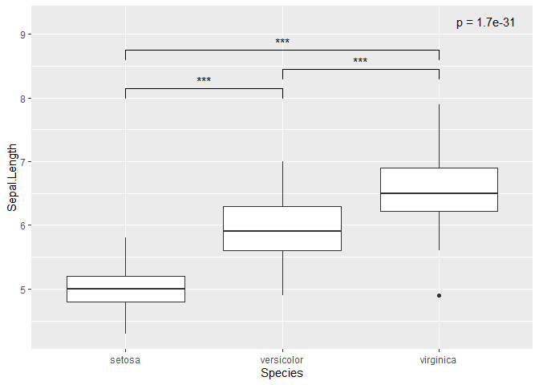
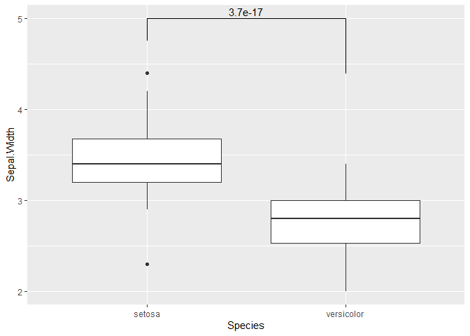

R Notebook
================

# 3그룹 비교

## Compare 3 groups

-   geom\_sigif의 comparisons에 비교군을 기입하여 내가 원하는 군을
    선택할 수 있습니다.

``` r
model <- aov(Sepal.Length ~ Species, data = iris)
summary(model)
```

    ##              Df Sum Sq Mean Sq F value Pr(>F)    
    ## Species       2  63.21  31.606   119.3 <2e-16 ***
    ## Residuals   147  38.96   0.265                   
    ## ---
    ## Signif. codes:  0 '***' 0.001 '**' 0.01 '*' 0.05 '.' 0.1 ' ' 1

``` r
p <- summary(model)[[1]][["Pr(>F)"]][1]
p
```

    ## [1] 1.669669e-31

``` r
ggplot(iris, aes(x = Species, y = Sepal.Length)) +
    geom_boxplot() + 
    geom_signif(
        comparisons = list(c("versicolor", "setosa")),
        map_signif_level = TRUE,
        y_position = 7.9
    ) + 
    geom_signif(
        comparison = list(c("versicolor", "virginica")),
        map_signif_level = TRUE,
        y_position = 8.2 ## 위치를 조금 올려주기 위해서 y position 설정        
    ) + 
    geom_signif(
        comparison = list(c("setosa", "virginica")),
        map_signif_level = TRUE,
        y_position = 8.5 ## 위치를 조금 올려주기 위해서 y position 설정        
    ) +
    annotate("text", label = glue("p = {format(p, digits = 2)}"), x = 3.3 , y = 9.2) # aov 결과
```

<!-- -->

### weighted T.test 사용 (or 다른 test 사용)

-   여기서는 기존의 t-test를 이용했으나 anno 변수 안에 원하시는 변수는
    p-value를 넣으시면 됩니다.

``` r
library(dplyr)
```

    ## 
    ## Attaching package: 'dplyr'

    ## The following object is masked from 'package:glue':
    ## 
    ##     collapse

    ## The following objects are masked from 'package:stats':
    ## 
    ##     filter, lag

    ## The following objects are masked from 'package:base':
    ## 
    ##     intersect, setdiff, setequal, union

``` r
data = iris %>% filter(Species %in% c("setosa", "versicolor"))

# 원하는 test
anno <- t.test(data$Sepal.Length ~ data$Species)$p.value
print(anno)
```

    ## [1] 3.746743e-17

``` r
# Make plot with custom x and y position of the bracket
ggplot(data, aes(x = Species, y = Sepal.Width)) +
  geom_boxplot(position = "dodge") +
  geom_signif(
    annotation = formatC(anno, digits = 2), # annotation으로 다른 test 결과 p_value 기입
    y_position = 5, # y 위치
    xmin = 1, # x 시작 위치
    xmax = 2, # x 끝 위치
    tip_length = c(0.1, 0.25) # 아래로 가는 선 길이 
  )
```

<!-- -->
